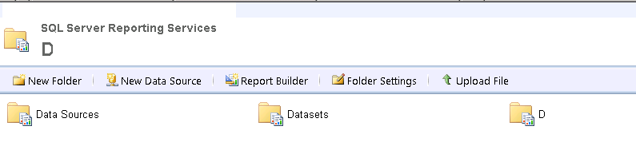
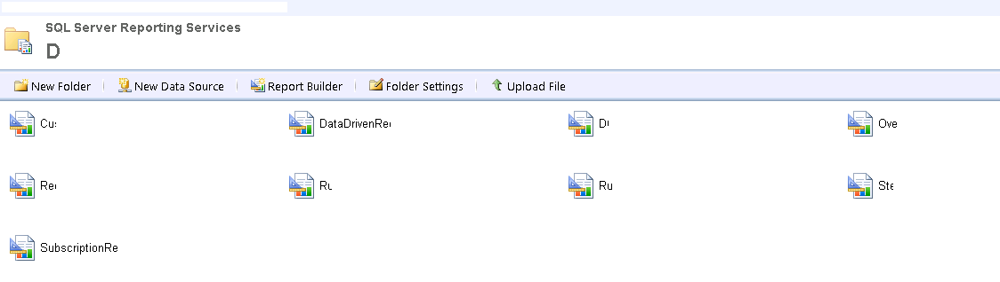
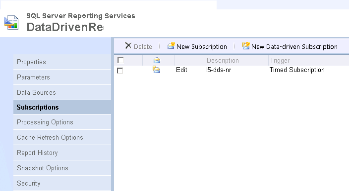
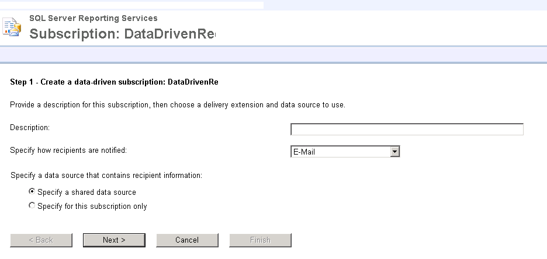
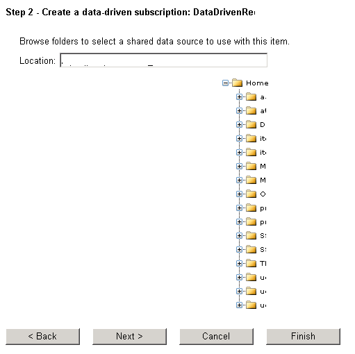
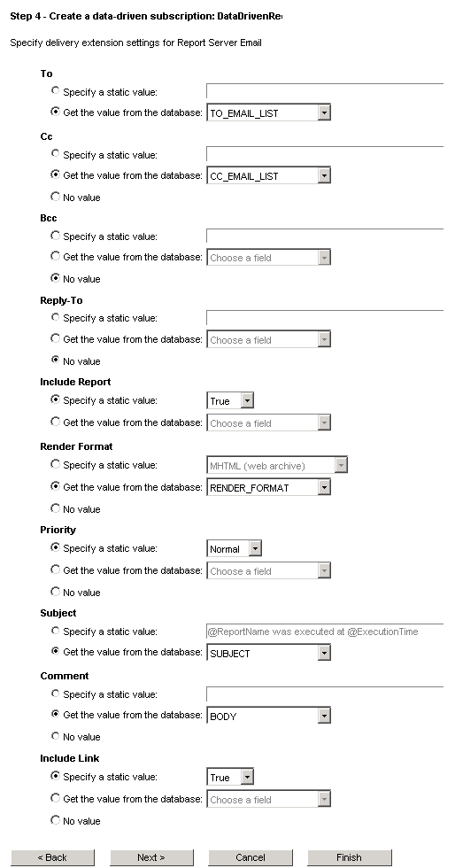
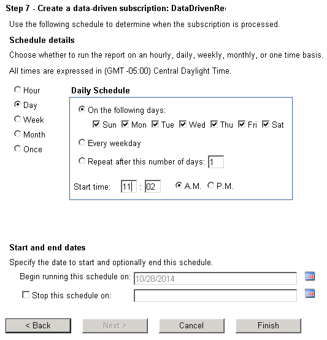

# Data Driven E-Mail Subscription #
---

**Get Data Source path to be used to get the subscription data.**

    Go to Report Manager URL for the deployed reports

    Go To “Datasets” folder

    Click on “DQ” dataset and click “Data Source” menu on the left. 
    Following screen will provide the Data Source path. Copy this path to be used later.

**Data Driven Email Subscription Steps**

    Go to report Manager URL for the deployed reports and click “D”

    Move Mouse Pointer over “DataDrivenRe” report.
    A drop down option will appear, click on that and select “Manage” option.

    Go to “Subscriptions” tab and Click “New Data-driven Subscription” option.

    Following 7 steps are to setup subscription with specific settings.
    Select / Enter following options and Click Next
      Description - Re DataDriven Subscription
      Specify how recipients are notified - E-Mail
      Specify a data source that contains recipient information - Specify a shared data source

    Select / Enter following options and Click Next
      Location - paste the path identified in “pre-requisites” section.

    Select / Enter following options and Click Next
      Copy Paste the queries which would return the subscription settings required.
      Click Validate , if you get a “Valid Query” message then proceed.

    Select / Enter following options and Click Next
      To - Select “Get the value from the database” select “TO_EMAIL_LIST” from dropdown
      Cc - Select “Get the value from the database” select “CC_EMAIL_LIST” from dropdown
      Include Report - Select “Specify a static value” select “True” from dropdown
      Render Format - Select “Get the value from the database” select “RENDER_FORMAT” from dropdown
      Subject - Select “Get the value from the database” select “SUBJECT” from dropdown
      Comment - Select “Get the value from the database” select “BODY” from dropdown
      Include Link - Select “no value”

    Select / Enter following options and Click Next
      VE - Select “Get the value from the database” select “NAME” from dropdown
      SUBSCRIPTIONID - Select “Get the value from the database” select “SubscriptionID” from dropdown

    Select / Enter following options and Click Next
      Notify recipients - On a schedule create for this subscription

    Select / Enter following options and Click Next
      Schedule details - Select option as needed.
                         Based on these selections report are trigger and sent out.

    One the Subscription is setup it will appear under “My Subscriptions”

