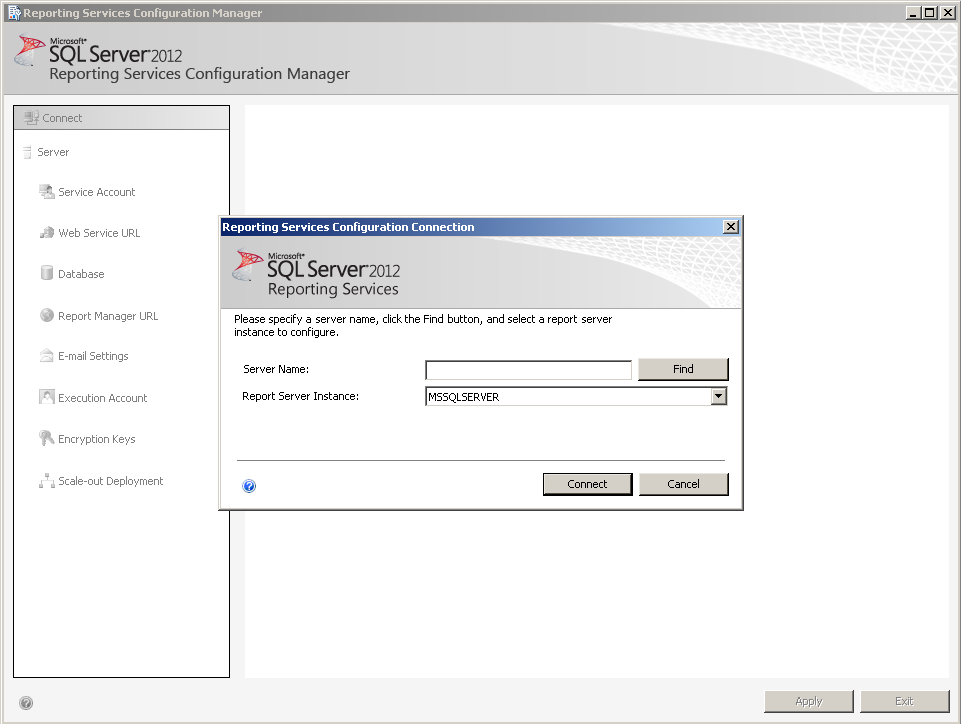
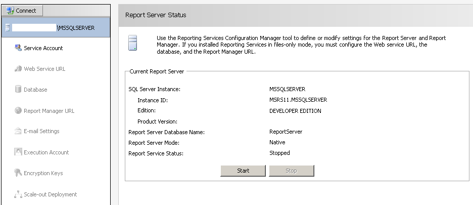
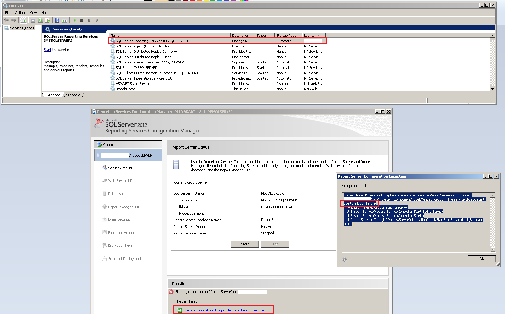
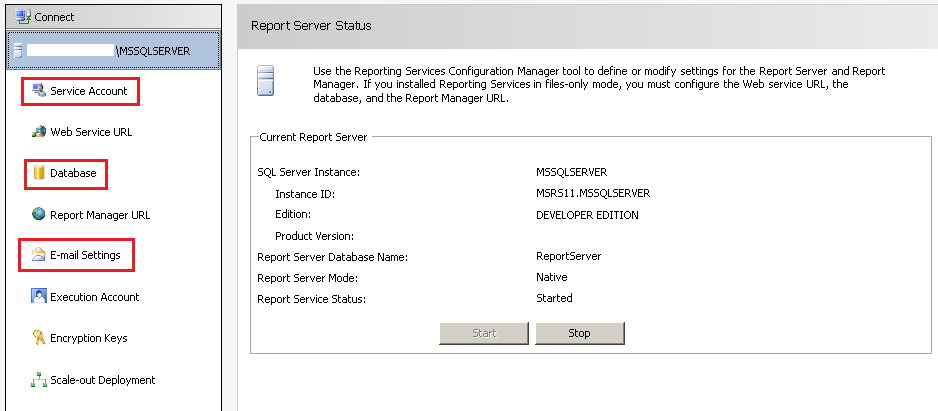
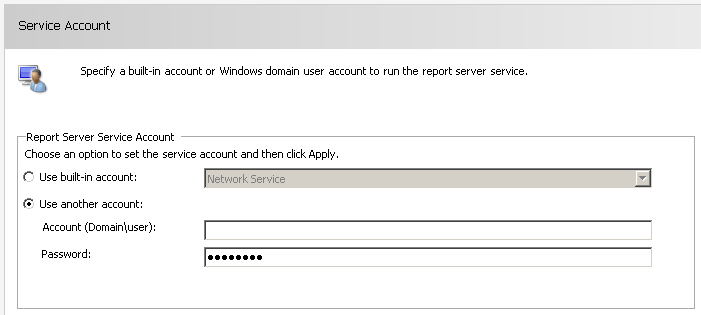
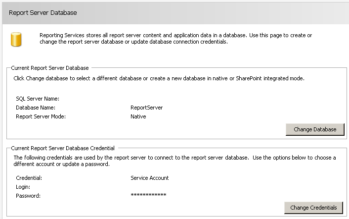
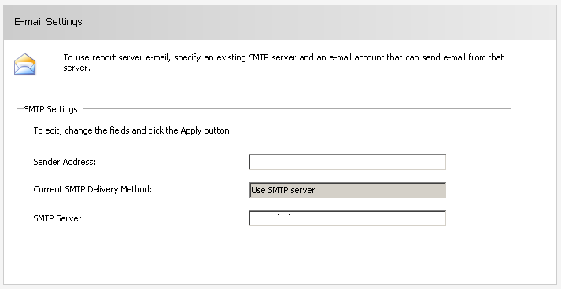

#Report Server Setup #
---

Open Reporting Services Configuration Manager from **Start Menu ... Microsoft SQL Server 2012 ... Configuration Tools**  
  

> Start-up Login screen will appear
> 
> >For server where there is no report server setup, it will start a setup wiz.
> >> Some of the Important report server settings are discussed [here](#ImportantSettings)
>   
> >If report server [LOCAL] was installed a Connect option will appear.  
> 
> > Connect to the required report server 
>    

Once Connected you need to start the ReportServer which will serve SSRS report 
>
>> This implies that SQL Reporting Service will now start serving report through specific URL
>
>> Start your server
>  

One of the issue faced while trying to start the ReportServer is a **LogOn failure**
>
>> Check on the link "Tell me more about the error" in Results sections
>> Error clearly say logon failure , but on what ??
>> OK, SQL Server Reporting Service (MSSQLSERVER) is running using specific LogOn User credentails and the password was changed
>>> Open "services.msc" from Run  
>>> Right click service and select "Properties"  
>>> Goto LogOn tab and Update the account password  
>>> Now start the service and subsequently try starting ReportServer

Once the ReportServer is up you'll see right side menu options activated.
>
>> These are the ReportServer settings
>> In case you are setting up the server first time these settings are self explanatory
>  

---  

## Some of the Important settings required to have a functional ReportServer are below {#ImportantSettings}

>
>>**Service Account**    
>>Used for report server request authentication  
>

>
>>**Database**  
>>Setup database and login credential used to access it  
>>This is usefully and credential are stored @report server    
>  

>
>>**Email**  
>>this is used for Email subscription to send out report in a automated fasion.  
>>more details on email subscription are [here](DataDrivenEmailSubscriptions.md)
>  
