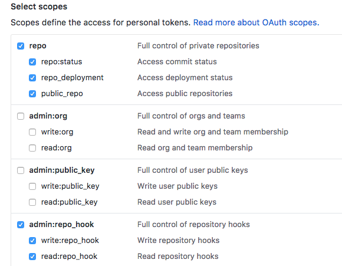
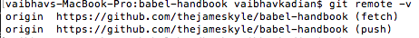
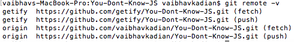

**GIT quick ref**
-

Authentication 
>github provides 3 ways to authenticate all request. 
>>username/password 
>>username/two-factor-auth 
>>username/access-tokens 

>username/password is the most basic auth, can be used from  github desktop, terminal. 
>username/tow-factor-auth is basic the recommended approach which forces user to provided both password and a time based key from an application pre configured and authenticated. Idea resonates to OTP type auth but rather then SMS its application based. 
>username/access-token on a very basic usage is like giving access based on a token, but its usage goes beyond that. 
>> for ex: if two-factor-auth is enabled, terminal commands would not work for password or time based key. rather to use termminal commands after enabling tow-factor-auth, one has to create access tokens and use them as password. 
> >to generate token 
> >>goto https://github.com/settings/tokens 
> >>click 'generate new token' 
> >>enter token description 
> >>select appropriate permissions/scope 
> >> 
> >>click "generate token" 
> >>copy the new token for futher ref as this will not be show later on anywhere. 
 
-

Updating Forked Repo 

>from source 
> >got the repo dir in terminal 
> >execute command 'git remote -v', it would show you list of active repo sources in the current dir. 
> >>if you clone a source git without fork 'origin' would point to source user. 
> >> 
> >>instead if you fork a repo and then clone it locally, it should have 'origin' pointing to forked repo by your username and '[source-repo-username]' (in the below case getify) pointing to the forke repo. 
> >> 
> >>All git commands by defualt works on 'origin' repo 
> >to add remote repo locally 
> >execute command 'git remote add [repo-name] [repo-url]' 
> >>ex: git remote add upstream https://github.com/ORIGINAL_OWNER/ORIGINAL_REPOSITORY.git 
> >to fetch latest branch execute command 'git fetch [repo-name] 
> >>ex: git fetch upstream 
> >to update origin or master branch 
> >execute command 'git checkout [repo-name] 
> >>ex: git checkout master 
> >to merge the forked source into origin 
> >execute command 'git merge upstream/master' 
> >>ex: git merge getify/master 
> >only step remaining is to update the change to github 
> >execute command 'git push' 
>refer source url for actual content: 
> >configure remote fork [refer] (https://help.github.com/articles/configuring-a-remote-for-a-fork/ "") 
> >sync fork [refer] (https://help.github.com/articles/syncing-a-fork/ "") 
 

